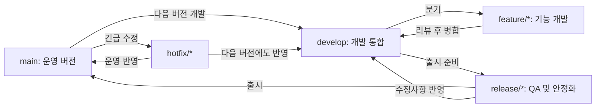

# Git Flow와 GitHub Flow 브랜치 전략

## 1. 들어가며

여러 개발자가 하나의 프로젝트를 동시에 수정하면 같은 파일을 고치거나, 아직 완성되지 않은 코드가 배포되거나, 어떤 변경이 장애를 일으켰는지 찾기 어려운 상황이 생길 수 있다. Git의 브랜치는 이런 문제를 줄이기 위해 작업 흐름을 분리하는 기능이다. 각 개발자는 독립된 브랜치에서 기능 개발이나 오류 수정을 진행하고, 검토와 테스트를 마친 변경만 공용 브랜치에 병합할 수 있다.

브랜치는 단순히 코드를 복사한 폴더가 아니라 특정 커밋을 가리키는 가벼운 포인터다. 따라서 생성과 전환이 빠르고, 기능별 작업 이력과 병합 관계를 명확히 남길 수 있다. 다만 브랜치의 이름, 생성 기준, 병합 대상, 배포 시점을 팀원마다 다르게 이해하면 오히려 혼란이 커진다. 이를 방지하기 위해 팀이 공통으로 정한 브랜치 운영 규칙을 **브랜치 전략(Branching Strategy)**이라고 한다.

대표적인 전략으로는 배포 단계를 여러 장기 브랜치로 관리하는 **Git Flow**와, 배포 가능한 기본 브랜치 및 짧게 유지되는 작업 브랜치를 중심으로 운영하는 **GitHub Flow**가 있다.

## 2. Git과 GitHub의 차이

- **Git**은 로컬 컴퓨터에서 파일 변경 이력을 기록하고 브랜치와 커밋을 관리하는 분산 버전 관리 시스템이다.
- **GitHub**는 Git 저장소를 원격으로 보관하며 이슈, Pull Request, 코드 리뷰, Actions, 브랜치 보호 규칙 등 협업 기능을 제공하는 플랫폼이다.
- `git add`, `git commit`, `git switch`, `git merge`는 Git 명령이다.
- Pull Request 생성, 리뷰 승인, 브랜치 보호, 이슈 연결은 주로 GitHub에서 수행한다.

즉, Git만으로도 버전 관리는 가능하지만 GitHub를 함께 사용하면 변경을 공유하고 검토·승인·자동 테스트·병합하는 협업 과정을 체계적으로 남길 수 있다.

## 3. 브랜치 전략이 필요한 이유

브랜치 전략을 사용하면 다음과 같은 효과를 얻을 수 있다.

1. **작업 격리**: 기능 개발과 버그 수정이 서로 영향을 주지 않는다.
2. **병렬 개발**: 여러 팀원이 각자의 브랜치에서 동시에 작업할 수 있다.
3. **변경 추적**: 이슈, 브랜치, 커밋, Pull Request를 연결해 변경 이유를 확인할 수 있다.
4. **코드 품질 향상**: 병합 전에 코드 리뷰와 자동 테스트를 수행할 수 있다.
5. **배포 안정성 확보**: 검증된 코드만 운영 또는 배포 브랜치에 반영할 수 있다.
6. **복구 용이성**: 문제가 발생한 커밋이나 Pull Request를 찾아 되돌리기 쉽다.

중요한 점은 복잡한 전략이 항상 좋은 전략은 아니라는 것이다. 제품의 배포 주기, 팀 규모, QA 환경, 동시 지원 버전, 자동 배포 여부에 맞는 전략을 선택해야 한다.

## 4. Git Flow

### 4.1 개념

Git Flow는 운영 코드와 다음 버전 개발 코드를 분리하고, 기능 개발·출시 준비·긴급 수정을 목적별 브랜치로 관리하는 전략이다. 정해진 출시 일정이 있고 개발, QA, 운영 환경이 명확히 나뉘는 프로젝트에 적합하다.

Git Flow는 보통 `main`, `develop`이라는 두 개의 장기 브랜치와 `feature`, `release`, `hotfix`라는 보조 브랜치를 사용한다. 기존 자료에서는 기본 브랜치를 `master`라고 표현하기도 하지만, 이 문서에서는 현재 GitHub에서 일반적으로 사용하는 이름인 `main`으로 통일한다.

### 4.2 브랜치별 역할

| 브랜치 | 생성 기준 | 병합 대상 | 역할 |
|---|---|---|---|
| `main` | 저장소의 기본 브랜치 | 해당 없음 | 실제 출시·배포 가능한 안정 버전 관리 |
| `develop` | 일반적으로 `main`에서 최초 생성 | 다음 `release`의 기준 | 다음 출시 버전에 포함될 개발 결과 통합 |
| `feature/*` | `develop` | `develop` | 새로운 기능 또는 일반 작업 개발 |
| `release/*` | `develop` | `main`, `develop` | 출시 후보 검증, 버전 번호 변경, 문서화, 최종 오류 수정 |
| `hotfix/*` | `main` | `main`, `develop` | 운영 중 발견된 긴급 장애나 치명적 오류 수정 |

팀의 배포 환경에 따라 브랜치 역할은 달라질 수 있다. 참고한 현업 사례에서는 `develop`을 알파 QA, `release`를 베타 QA, `main`을 운영 배포 단계에 연결했다. 이는 Git Flow의 고정 규칙이라기보다 조직의 배포 환경에 맞춘 변형이다.

### 4.3 일반적인 작업 흐름



기능 개발의 기본 흐름은 다음과 같다.

```bash
git switch develop
git pull origin develop
git switch -c feature/practice-apis

# 코드 작성 및 확인
git add app/apis/practice_apis.py app/main.py
git commit -m "feat: practice API 라우터 추가"
git push -u origin feature/practice-apis
```

이후 GitHub에서 `feature/practice-apis`를 `develop`에 병합하는 Pull Request를 만들고, 리뷰와 테스트가 끝난 뒤 병합한다. 출시 시점에는 `develop`에서 `release/*`를 만들고 QA를 진행한 후 `main`과 `develop`에 모두 반영한다.

### 4.4 장점

- 개발 중인 다음 버전과 현재 운영 버전을 명확히 분리할 수 있다.
- 기능 개발, 출시 준비, 긴급 수정의 목적과 책임이 브랜치 이름에 드러난다.
- 별도의 QA 기간과 정기 배포 일정이 있는 조직에서 단계별 검증이 쉽다.
- 여러 버전 또는 여러 배포 환경을 체계적으로 관리하기 좋다.

### 4.5 단점과 주의점

- 장기 브랜치가 많아 병합 경로와 규칙을 익히는 데 시간이 필요하다.
- `main`, `develop`, `release` 사이의 동기화를 놓치면 같은 수정이 누락되거나 충돌이 커질 수 있다.
- 기능 브랜치가 오래 유지될수록 공용 브랜치와 차이가 커져 병합 비용이 증가한다.
- 작은 프로젝트나 수시 배포 프로젝트에는 절차가 과도할 수 있다.
- 이미 공유된 브랜치에 무분별한 강제 푸시를 하면 다른 팀원의 이력을 손상시킬 수 있다. 불가피한 경우 일반 `--force`보다 원격 변경을 확인하는 `--force-with-lease`가 상대적으로 안전하다.

## 5. GitHub Flow

### 5.1 개념

GitHub Flow는 항상 배포 가능한 하나의 기본 브랜치와, 작업마다 짧게 생성되는 브랜치를 중심으로 운영하는 가벼운 전략이다. GitHub 공식 문서가 설명하는 핵심 과정은 브랜치 생성, 변경 및 커밋, Pull Request 생성, 리뷰와 테스트, 병합, 배포다.

GitHub Flow를 단순히 `main`과 단 하나의 `feature` 브랜치만 유지하는 방식으로 이해하면 정확하지 않다. 실제로는 `main` 외에 기능, 문서, 버그 수정 등 **작업별 브랜치가 여러 개 동시에 존재할 수 있지만**, 작업이 끝나면 빠르게 `main`에 병합하고 삭제한다. `develop`이나 `release` 같은 장기 통합 브랜치를 기본적으로 두지 않는다는 점이 핵심이다.

### 5.2 기본 원칙

1. `main`은 언제나 실행 및 배포 가능한 상태로 유지한다.
2. 새로운 작업은 최신 `main`에서 별도 브랜치를 만들어 시작한다.
3. 의미 있는 작은 단위로 커밋하고 원격 저장소에 자주 푸시한다.
4. Pull Request에서 작업 목적, 변경 내용, 테스트 결과를 공유한다.
5. 팀원의 리뷰와 자동 테스트를 통과한 변경만 `main`에 병합한다.
6. 병합된 `main`을 배포하고 작업 브랜치는 삭제한다.

### 5.3 작업 흐름


예를 들어 이번 과제의 문서 작업은 다음과 같이 진행할 수 있다.

```bash
git switch main
git pull origin main
git switch -c docs/git-branch-strategy

# docs/2일차_git_branch_전략.md 작성
git add docs/2일차_git_branch_전략.md
git commit -m "docs: Git Flow와 GitHub Flow 전략 정리"
git push -u origin docs/git-branch-strategy
```

그다음 GitHub에서 `docs/git-branch-strategy` → `main` Pull Request를 생성한다. 팀원이 내용을 검토하고 승인한 뒤 병합하면 문서가 원격 저장소의 `main`에서 확인된다.

### 5.4 장점

- 규칙과 브랜치 구조가 단순하여 학습과 운영이 쉽다.
- 작업 브랜치를 짧게 유지하므로 큰 병합 충돌이 발생할 가능성이 낮다.
- Pull Request 중심의 대화와 코드 리뷰가 자연스럽게 기록된다.
- 자동 테스트와 지속적 통합·배포(CI/CD)에 연결하기 좋다.
- 웹 서비스처럼 자주 수정하고 배포하는 프로젝트에 적합하다.

### 5.5 단점과 주의점

- `main`에 병합된 코드가 곧 배포 가능한 코드라는 전제가 필요하다.
- 자동 테스트와 리뷰 규칙이 부족하면 결함이 빠르게 `main`에 들어갈 수 있다.
- 별도의 긴 QA 기간이나 여러 출시 버전을 동시에 관리해야 하는 제품에는 부족할 수 있다.
- 작업 브랜치가 오래 유지되면 GitHub Flow의 단순성과 빠른 피드백이라는 장점이 약해진다.

## 6. Git Flow와 GitHub Flow 비교

| 비교 항목 | Git Flow | GitHub Flow |
|---|---|---|
| 기본 구조 | `main`, `develop` 및 보조 브랜치 | `main`과 작업별 단기 브랜치 |
| 주요 작업 브랜치 | `feature`, `release`, `hotfix` | `feature`, `fix`, `docs` 등 목적별 자유로운 브랜치 |
| 배포 방식 | 정기·버전 단위 배포에 유리 | 지속적·빈번한 배포에 유리 |
| QA 운영 | `develop`, `release` 등 단계별 환경과 연결하기 쉬움 | PR과 CI에서 빠르게 검증하는 방식에 적합 |
| 복잡도 | 비교적 높음 | 비교적 낮음 |
| 병합 경로 | 목적에 따라 여러 브랜치에 반영 | 대부분 작업 브랜치에서 `main`으로 병합 |
| 적합한 프로젝트 | 출시 주기가 명확한 제품, 다중 버전, 엄격한 QA | 웹 서비스, 소규모 팀, 자동 배포, 빠른 피드백 |
| 주의점 | 장기 브랜치 동기화와 병합 충돌 | `main` 안정성을 위한 리뷰·테스트 필수 |

두 전략의 우열을 절대적으로 정할 수는 없다. 배포 승인 단계가 많고 버전별 안정화 기간이 필요하면 Git Flow가 유리하고, 변경을 작게 나누어 자주 통합·배포한다면 GitHub Flow가 더 효율적이다. 팀 상황에 따라 GitHub Flow에 `release` 브랜치를 일시적으로 추가하는 등 일부 규칙을 조합할 수도 있지만, 예외 규칙은 반드시 문서화해야 한다.

## 7. 이번 FastAPI 과제에 적용할 전략

이번 과제에서는 **GitHub Flow**를 선택한다.

선택 이유는 다음과 같다.

- 기능 규모가 작고 개발 기간이 짧다.
- 최종 산출물이 하나의 FastAPI 애플리케이션이다.
- 문서와 API 구현을 독립된 Pull Request로 나누기 쉽다.
- 과제의 필수 과정인 브랜치 분기, 커밋, 푸시, PR, 리뷰, 병합을 간결하고 분명하게 기록할 수 있다.
- 별도의 출시 후보 관리나 여러 운영 버전 유지가 필요하지 않다.

### 7.1 사용할 브랜치

- `main`: 실행과 제출이 가능한 최종 코드
- `docs/git-branch-strategy`: 브랜치 전략 문서 작성
- `feature/practice-apis`: FastAPI API 구현
- 필요할 경우 `fix/<설명>`: 리뷰 또는 테스트에서 발견된 별도 오류 수정

### 7.2 팀 작업 규칙

1. 작업 시작 전에 `main`을 최신 상태로 갱신한다.
2. 한 브랜치는 하나의 명확한 작업만 담당한다.
3. 브랜치 이름은 `feature/`, `fix/`, `docs/`, `test/`, `refactor/` 등의 접두사를 사용한다.
4. 커밋은 리뷰 가능한 작은 단위로 만들고 제목만 읽어도 목적을 알 수 있게 작성한다.
5. `main`에 직접 푸시하지 않고 Pull Request를 통해 병합한다.
6. PR 본문에 작업 목적, 주요 변경, 테스트 방법, 결과를 작성한다.
7. 최소 한 명의 팀원이 리뷰하고 승인한 뒤 병합한다.
8. 충돌이 발생하면 변경 의도를 아는 작성자가 해결하고 다시 테스트한다.
9. 병합 후 원격 및 로컬 작업 브랜치를 정리한다.

권장 커밋 예시는 다음과 같다.

```text
docs: Git 브랜치 전략 문서 작성
feat: 할 일 생성 API 추가
fix: 존재하지 않는 할 일 응답 수정
test: practice API 테스트 추가
refactor: API 라우터 분리
chore: 개발 의존성 설정
```

## 8. 과제 수행 절차

### 8.1 문서 작업

```bash
git switch main
git pull origin main
git switch -c docs/git-branch-strategy
git add docs/2일차_git_branch_전략.md
git commit -m "docs: Git Flow와 GitHub Flow 전략 정리"
git push -u origin docs/git-branch-strategy
```

이후 Pull Request를 만들고 다음 항목을 확인한다.

- 파일 경로와 이름이 과제 조건에 맞는가?
- Git Flow와 GitHub Flow의 구조, 장단점, 차이가 설명되어 있는가?
- 팀이 선택한 전략과 선택 이유가 적혀 있는가?
- 리뷰 의견이 반영되고 대화가 해결 처리되었는가?
- 병합 후 GitHub의 `main` 브랜치에서 파일이 보이는가?

### 8.2 FastAPI 작업

문서 PR을 병합한 다음 최신 `main`에서 API 브랜치를 만든다.

```bash
git switch main
git pull origin main
git switch -c feature/practice-apis
```

과제에서 지정한 구조는 다음과 같다.

```text
app/
├── __init__.py
├── main.py
└── apis/
    ├── __init__.py
    └── practice_apis.py
```

`app/apis/practice_apis.py`에는 `APIRouter` 객체와 API 엔드포인트를 작성하고, `app/main.py`에서는 `FastAPI` 객체에 라우터를 포함한다.

```python
# app/apis/practice_apis.py
from fastapi import APIRouter

router = APIRouter(prefix="/practice", tags=["practice"])
```

```python
# app/main.py
from fastapi import FastAPI

from app.apis.practice_apis import router as practice_router

app = FastAPI(title="FastAPI Practice")
app.include_router(practice_router)
```

위 코드는 구조를 설명하기 위한 최소 골격이다. 실제 엔드포인트의 경로, HTTP 메서드, 요청·응답 모델, 상태 코드는 과제의 API 요구사항에 맞춰 추가해야 한다.

서버 실행 예시는 다음과 같다.

```bash
python -m uvicorn app.main:app --reload
```

실행 후 `http://127.0.0.1:8000/docs`의 Swagger UI에서 다음을 확인한다.

- 요구된 모든 API가 표시되는가?
- 경로·쿼리 매개변수와 요청 본문이 올바르게 입력되는가?
- 정상 요청의 상태 코드와 응답 본문이 요구사항과 일치하는가?
- 잘못된 요청과 존재하지 않는 리소스가 적절한 오류를 반환하는가?
- 수정과 삭제 후 조회 결과에 변경이 반영되는가?

테스트가 끝나면 커밋과 푸시를 수행한다.

```bash
git add app tests
git commit -m "feat: practice API 구현"
git push -u origin feature/practice-apis
```

PR 리뷰와 테스트를 통과한 뒤 `main`에 병합한다. 과제 평가를 위해 브랜치 생성, 커밋, 원격 푸시, PR, 리뷰 승인, 병합 기록을 삭제하지 않고 남겨야 한다.

## 9. Pull Request 작성 예시

```markdown
## 작업 목적
- FastAPI 실습 요구사항에 맞는 API를 구현합니다.

## 주요 변경 사항
- `app/apis/practice_apis.py`에 API 라우터 추가
- `app/main.py`에 practice 라우터 등록
- 정상 및 오류 응답 테스트 추가

## 테스트 방법
1. `python -m uvicorn app.main:app --reload` 실행
2. `http://127.0.0.1:8000/docs` 접속
3. 각 API의 정상·실패 요청 확인

## 테스트 결과
- [ ] 서버가 정상 실행됨
- [ ] Swagger UI에서 전체 API 확인
- [ ] 전체 자동 테스트 통과
```

리뷰어는 기능 요구사항뿐 아니라 API 경로, HTTP 메서드, 상태 코드, 데이터 검증, 예외 처리, 중복 코드, 테스트 범위를 확인한다. 작성자는 피드백을 새 커밋으로 반영하고, 리뷰어가 수정 사항을 재확인할 수 있도록 해당 커밋과 변경 내용을 댓글로 알린다.

## 10. 병합 방식

GitHub에서는 보통 세 가지 병합 방식을 제공한다.

- **Create a merge commit**: 브랜치의 커밋과 병합 커밋을 모두 보존한다. 실제 분기와 병합 이력이 잘 보이지만 기록이 복잡해질 수 있다.
- **Squash and merge**: PR의 여러 커밋을 하나로 합쳐 `main`에 반영한다. `main` 이력이 간결해지지만 PR 내부의 세부 커밋은 기본 이력에서 합쳐진다.
- **Rebase and merge**: 작업 커밋을 `main` 끝에 재배치하여 선형 이력을 만든다. 커밋 단위는 유지하지만 커밋 해시가 바뀐다.

이번 과제에서는 과정 증빙과 간결한 `main` 이력을 함께 고려해 **Squash and merge**를 권장한다. 작업 중의 세부 논의와 커밋은 PR에서 확인할 수 있고, `main`에는 하나의 완결된 작업으로 남는다. 다만 평가 기준이 분기 그래프 자체를 요구한다면 팀원 및 강사와 상의하여 merge commit 방식을 선택할 수 있다.

## 11. 결론

Git Flow는 여러 장기 브랜치로 개발, 출시 준비, 운영, 긴급 수정 단계를 명시적으로 분리하기 때문에 정기 출시와 단계별 QA가 필요한 프로젝트에 적합하다. 반면 GitHub Flow는 최신 `main`에서 작업 브랜치를 만들고 Pull Request를 통해 빠르게 검토·병합·배포하는 방식이므로 작은 팀, 웹 서비스, 지속적 배포 환경에 적합하다.

이번 FastAPI 과제는 규모가 작고 최종 결과를 하나의 `main` 브랜치에 통합하면 되므로 GitHub Flow를 적용하는 것이 효율적이다. 단순한 전략을 선택하더라도 `main` 직접 수정 금지, 작업별 브랜치, 명확한 커밋, PR 설명, 팀원 리뷰, 테스트 통과 같은 기본 규칙은 반드시 지켜야 한다. 전략의 이름보다 중요한 것은 팀 전체가 같은 규칙을 이해하고, 실제 변경 이력을 재현 가능하게 남기는 것이다.

## 12. 참고 자료

### 브랜치 전략

- [Pro Git - Branches in a Nutshell](https://git-scm.com/book/en/v2/Git-Branching-Branches-in-a-Nutshell)
- [GitHub Docs - GitHub flow](https://docs.github.com/en/get-started/using-github/github-flow)
- [Vincent Driessen - A successful Git branching model](https://nvie.com/posts/a-successful-git-branching-model/)
- [주니어 개발자의 현업에서 배운 Git Flow](https://velog.io/@myoungji-kim/git-flow)
- [DEVOCEAN - Git Branch 전략 비교: Git Flow vs GitHub Flow](https://devocean.sk.com/blog/techBoardDetail.do?ID=165571&boardType=techBlog)
- [HEROPY.DEV - 사례로 이해하는 GitHub Flow](https://www.heropy.dev/p/6hdJi6)

### FastAPI

- [FastAPI 공식 자습서](https://fastapi.tiangolo.com/ko/tutorial/)
- [FastAPI 공식 문서 - Bigger Applications](https://fastapi.tiangolo.com/tutorial/bigger-applications/)
- [위키독스 - FastAPI 시작하기](https://wikidocs.net/318174)
- [FastAPI 실습: 간단한 할 일 목록 애플리케이션](https://13akstjq.github.io/TIL/post/2024-07-09-Hands-OnwithFastAPICreatingaSimpleTo-DoListApplication)

> 제공된 Notion의 `Git Command 학습 자료`와 `Git 시스템을 활용한 프로젝트 버전 관리` 링크는 외부 열람 권한이 없어 본문을 확인하지 못했다. 따라서 공개적으로 확인 가능한 자료와 공식 문서를 기준으로 작성했다.
