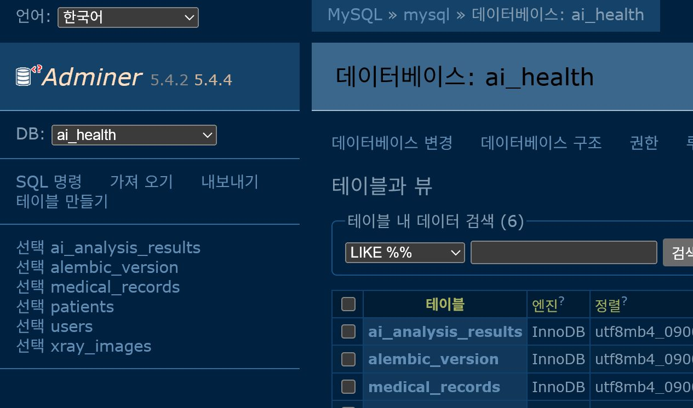

# 3일차 DB 모델 작성 및 마이그레이션

## 1. 과제 목표

제공된 ERD를 SQLAlchemy 2.x ORM 모델로 구현하고, Alembic 마이그레이션을 통해 실제 MySQL 데이터베이스에 스키마를 반영한다. 마지막으로 DB Viewer에서 생성된 테이블을 확인한다.

> 과제 안내에는 `apps/models/`라고 적혀 있지만, 프로젝트 템플릿의 실제 패키지 경로에 맞춰 `app/models/`에 모델을 작성했다.

## 2. 데이터베이스 선택

이번 과제에서는 **MySQL 8.0**을 선택했다.

- 운영 환경에서 널리 사용되는 관계형 데이터베이스이다.
- 외래키, 인덱스, `ENUM`, `DECIMAL` 등 ERD의 자료형과 제약 조건을 직접 확인할 수 있다.
- Docker Compose를 사용하면 팀원들이 동일한 버전과 설정으로 실행할 수 있다.
- Adminer를 함께 실행해 별도 데스크톱 프로그램 없이 브라우저에서 스키마를 확인할 수 있다.

구성한 서비스는 다음과 같다.

| 서비스 | 이미지 | 포트 | 역할 |
| --- | --- | --- | --- |
| MySQL | `mysql:8.0` | `3306` | 애플리케이션 데이터 저장 |
| Adminer | `adminer:5` | `8080` | DB 스키마 확인용 웹 Viewer |

실제 비밀번호가 포함된 `.env`는 Git에 올리지 않고, 필요한 환경 변수 이름만 `.env.example`로 공유한다.

## 3. 모델 파일 구성

| 파일 | 테이블 | 주요 역할 |
| --- | --- | --- |
| `app/models/user.py` | `users` | 의료진 사용자, 부서와 권한 정보 관리 |
| `app/models/patient.py` | `patients` | 환자의 기본 정보 관리 |
| `app/models/medical_record.py` | `medical_records` | 환자의 진료 기록 관리 |
| `app/models/xray_image.py` | `xray_images` | 진료 기록에 연결된 X-ray 이미지 관리 |
| `app/models/ai_analysis_result.py` | `ai_analysis_results` | 폐렴 여부, 신뢰도 등 AI 분석 결과 관리 |
| `app/models/enums.py` | - | 성별, 부서, 권한 열거형 공통 관리 |
| `app/models/__init__.py` | - | Alembic이 전체 모델을 발견하도록 모델 import |

SQLAlchemy 2.x의 `Mapped`, `mapped_column`, `relationship` 문법을 사용했고, 모든 모델은 `app.core.db.databases.Base`를 상속한다.

## 4. 테이블 관계와 삭제 정책

| 부모 | 자식 | 관계 | 외래키 삭제 정책 |
| --- | --- | --- | --- |
| `patients` | `medical_records` | 환자 1 : N 진료 기록 | `CASCADE` |
| `medical_records` | `xray_images` | 진료 기록 1 : N X-ray 이미지 | `CASCADE` |
| `medical_records` | `ai_analysis_results` | 진료 기록 1 : N AI 분석 결과 | `CASCADE` |
| `users` | `xray_images` | 사용자 1 : N 업로드 이미지 | `SET NULL` |

`users`가 삭제되어도 의료 기록의 X-ray 이미지는 보존해야 하므로 `xray_images.uploader_id`는 nullable로 정의하고 `ON DELETE SET NULL`을 적용했다. 반면 환자나 진료 기록에 종속되는 데이터는 부모가 삭제되면 함께 제거되도록 `CASCADE`를 적용했다.

## 5. Alembic 모델 인식 설정

`alembic/env.py`에서 공통 `Base.metadata`를 Alembic의 `target_metadata`로 지정한다.

```python
from app.core.db.databases import Base, DATABASE_URL
from app import models

config.set_main_option("sqlalchemy.url", DATABASE_URL)
target_metadata = Base.metadata
```

`from app import models`가 실행될 때 `app/models/__init__.py`가 모든 모델을 import하므로, Alembic autogenerate가 다섯 모델의 테이블과 관계를 발견할 수 있다.

## 6. 마이그레이션 수행 과정

프로젝트 디렉터리인 `AH_web_development_assignment`에서 다음 순서로 실행했다.

### 6.1 컨테이너 실행

```bash
docker compose up -d mysql adminer
docker compose ps
```

확인 결과 MySQL 컨테이너는 `healthy`, Adminer 컨테이너는 `Up` 상태였다.

### 6.2 마이그레이션 파일 생성

```bash
alembic revision --autogenerate -m "create ai health tables"
```

생성된 파일:

```text
alembic/versions/fded53d3c0af_create_ai_health_tables.py
```

자동 생성 결과에서 다음 다섯 테이블의 `create_table` 명령과 `downgrade`의 역순 `drop_table` 명령을 검토했다.

```text
patients
users
medical_records
ai_analysis_results
xray_images
```

### 6.3 데이터베이스에 적용

```bash
alembic upgrade head
alembic current
alembic history
```

현재 리비전이 다음과 같이 `head`인 것을 확인했다.

```text
fded53d3c0af (head)
```

### 6.4 다운그레이드·업그레이드 왕복 검증

마이그레이션의 실행 취소와 재적용이 모두 가능한지 확인했다.

```bash
alembic downgrade base
alembic upgrade head
alembic current
```

`downgrade`에서 자식 테이블부터 제거되고, 다시 `upgrade`했을 때 다섯 테이블과 외래키가 정상 생성됐다.

## 7. 실제 스키마 검증 결과

MySQL `information_schema`를 조회해 다음 내용을 확인했다.

- 업무 테이블 5개와 Alembic 버전 관리 테이블 1개가 생성됐다.
- 기본 키는 모두 자동 증가로 생성됐다.
- `users.email`, `users.phone_number`, `medical_records.chart_number`에 UNIQUE 제약 조건이 적용됐다.
- `ai_analysis_results.confidence`는 `DECIMAL(5, 2)`로 생성됐다.
- `users.gender`, `users.department`, `users.role`은 ERD에 맞는 ENUM 값으로 생성됐다.
- 외래키 삭제 규칙은 `CASCADE` 3개와 `SET NULL` 1개로 생성됐다.
- `ON DELETE SET NULL`이 가능한 형태로 `xray_images.uploader_id`가 nullable로 생성됐다.

## 8. DB Viewer 확인

Adminer에서 `ai_health` 데이터베이스를 열어 다음 테이블을 확인했다.

```text
ai_analysis_results
alembic_version
medical_records
patients
users
xray_images
```



위 화면에서 Alembic이 관리하는 `alembic_version`과 ERD를 기반으로 작성한 다섯 업무 테이블이 모두 생성된 것을 확인할 수 있다.

## 9. 검증 체크리스트

- [x] ERD 기반 SQLAlchemy ORM 모델 5개 작성
- [x] 모델별 파일 분리 및 `app/models/__init__.py`에서 통합 import
- [x] MySQL 8.0 컨테이너 정상 실행
- [x] Alembic autogenerate 마이그레이션 파일 생성
- [x] `alembic upgrade head` 적용
- [x] `downgrade base → upgrade head` 왕복 검증
- [x] 실제 컬럼·UNIQUE·외래키 삭제 규칙 확인
- [x] Adminer DB Viewer에서 테이블 생성 화면 확인
- [x] `.env` 제외 및 `.env.example` 제공

## 10. 작업 시 주의사항

- `.env`에는 비밀번호가 있으므로 절대 커밋하지 않는다.
- 모델을 새로 추가하면 `app/models/__init__.py`에서 import되는지 확인한다.
- `--autogenerate` 결과를 그대로 믿지 말고 자료형, nullable, UNIQUE, 외래키와 삭제 순서를 검토한다.
- 팀원이 같은 DB 볼륨을 사용 중이라면 마이그레이션 리비전이 서로 다른 상태에서 임의로 `downgrade`하지 않는다.
- 마이그레이션 파일은 이미 공유된 뒤 수정하기보다 새 리비전을 추가하는 방식으로 변경 이력을 남긴다.
