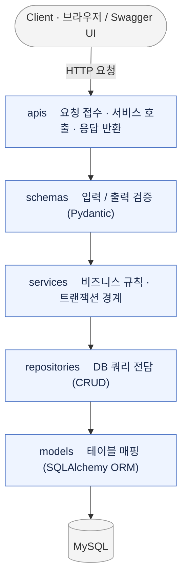
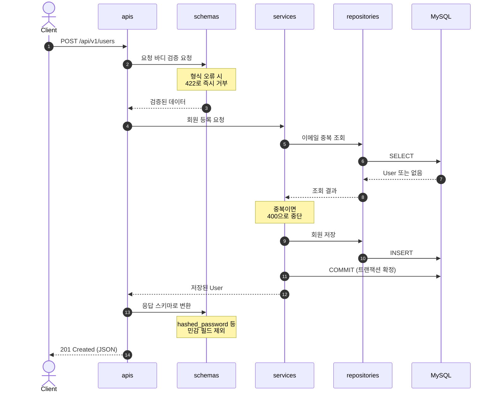

# 3일차 프로젝트 뜯어보기

## 5. API 구현 흐름

요청 하나가 들어와서 응답으로 나가기까지, API가 어떤 구조 위에서 어떤 순서로 동작하는지를 정리합니다. 회원 생성 API(`POST /api/v1/users`)를 예로 들어 흐름을 따라가 보겠습니다.

### 5.1 계층형 아키텍처 한눈에 보기

이 프로젝트는 하나의 요청을 다섯 개의 레이어가 나눠서 처리합니다. 요청을 받는 곳(apis), 데이터를 검증하는 곳(schemas), 규칙을 판단하는 곳(services), DB에 접근하는 곳(repositories), 테이블을 정의하는 곳(models)으로 책임이 갈립니다.

의존성은 `apis → schemas → services → repositories → models` 한 방향으로만 흐릅니다. 위 레이어는 아래 레이어를 호출하지만, 아래 레이어는 위를 알지 못합니다. 덕분에 한 레이어를 고쳐도 다른 레이어가 잘 깨지지 않고, 하위 레이어(모델·리포지토리)는 독립적으로 재사용하거나 테스트하기 쉽습니다.

각 레이어가 맡는 일과 대표 파일은 다음과 같습니다.

| 레이어 | 맡은 일 | 대표 파일 |
|---|---|---|
| `apis` | 요청을 받고, 서비스를 호출하고, 응답을 반환 | `app/apis/user_apis.py` |
| `schemas` | 입력·출력 데이터의 형태와 규칙을 검증 | `app/schemas/user_schema.py` |
| `services` | 비즈니스 규칙 판단과 트랜잭션 경계 관리 | `app/services/user_service.py` |
| `repositories` | DB 쿼리(조회·생성·수정·삭제)만 담당 | `app/repositories/user_repository.py` |
| `models` | 테이블 구조를 코드로 매핑 | `app/models/user.py` |

### 5.2 회원 생성 요청은 이렇게 흐릅니다

요청이 각 레이어를 지나 응답으로 돌아오는 과정을 순서대로 나타내면 다음과 같습니다.

단계별로 풀어 쓰면 이렇습니다.

1. **요청 수신 (apis)** — FastAPI가 URL과 HTTP 메서드로 라우터 함수를 찾고, 요청 바디를 스키마로 넘깁니다.
2. **입력 검증 (schemas)** — Pydantic이 이름 길이·이메일 형식·비밀번호 규칙을 검사합니다. 형식이 어긋난 요청은 서비스까지 가지 않고 `422 Unprocessable Entity`로 바로 거부됩니다.
3. **세션 준비 (core/db)** — `Depends(async_get_db)`가 요청 하나 동안만 살아있는 DB 세션을 열어 라우터에 넘겨줍니다.
4. **규칙 판단 (services)** — 이메일 중복 같은 도메인 규칙을 확인합니다. 규칙을 어기면 여기서 `400` 같은 예외를 던지고, 통과하면 저장을 리포지토리에 맡깁니다.
5. **쿼리 실행 (repositories → models)** — 조회·저장 쿼리가 실행되고, 모델에 정의된 컬럼 매핑을 따라 실제 SQL이 만들어져 MySQL로 전달됩니다.
6. **트랜잭션 확정 (services)** — `commit()`을 호출해야 비로소 DB에 반영됩니다. 도중에 예외가 나면 커밋 없이 세션이 정리되면서 변경이 자동으로 버려집니다(암묵적 롤백).
7. **응답 변환 (schemas)** — 저장된 결과가 응답 스키마로 직렬화되며, `hashed_password`처럼 응답 스키마에 없는 필드는 이 과정에서 자동으로 빠집니다.
8. **응답 반환 (apis)** — 최종 JSON이 `201 Created`와 함께 클라이언트로 돌아가고, 같은 스펙이 Swagger UI(`/docs`)에도 자동 반영됩니다.

### 5.3 예외 처리는 어느 레이어에서?

예외는 그 성격에 맞는 레이어에서 처리해야 각 레이어의 독립성이 유지됩니다.

| 상황 | 처리 위치 | 이유 |
|---|---|---|
| 요청 형식이 잘못됨 (필수값 누락, 타입 불일치) | `schemas` (Pydantic 자동 처리) | FastAPI가 `422` 응답을 자동 생성하므로 별도 코드가 필요 없음 |
| 존재하지 않는 리소스 조회 (`404`) | `services` | 존재 여부는 비즈니스 판단이라, `repositories`는 `None`만 돌려줘야 재사용성이 높음 |
| 중복 데이터·권한 없음 등 규칙 위반 (`400`, `403`) | `services` | 여러 리포지토리를 조합해야 판단 가능한 경우가 많음 |
| DB 자체 오류 (연결 실패 등) | `repositories`/`core` (전역 핸들러) | 특정 API 로직과 무관한 인프라 문제이므로 공통 처리 |

핵심은 `repositories`가 `HTTPException`을 직접 던지지 않고 `None`이나 빈 리스트만 반환한다는 점입니다. HTTP 관련 예외를 `services` 이상에서만 다루면, `repositories`가 FastAPI 같은 웹 프레임워크에 묶이지 않고 독립적으로 재사용됩니다.

### 5.4 현재 코드(`practice_apis.py`)에서 목표 구조로

지금의 `app/apis/practice_apis.py`는 학습용으로 레이어를 압축해, 라우터 함수 안에서 메모리 리스트(`user_list`)를 직접 조회·수정하고 있습니다. 앞으로는 같은 기능을 유지하면서 각 책임을 제자리 레이어로 옮기게 됩니다.

| 구분 | 현재 (`practice_apis.py`) | 목표 구조 |
|---|---|---|
| 데이터 저장소 | 파이썬 리스트, 서버 재시작 시 초기화 | MySQL (비동기 엔진) |
| 입력 검증 | `UserCreate`/`UserUpdate` | 그대로 `app/schemas/`로 |
| 중복 이메일 검사 | 라우터 안 `for` 루프 | `app/services/`로 이동 |
| 조회·추가·삭제 | 라우터 안 리스트 조작 | `app/repositories/`의 쿼리로 대체 |
| 라우터 역할 | 검증+로직+저장을 모두 수행 | 서비스 호출과 응답 반환만 수행 |

즉 코드를 새로 짜는 게 아니라, 흩어진 책임을 레이어별로 나누는 리팩터링입니다. 검증 규칙은 거의 그대로 재사용하고, 중복 검사와 데이터 조작 로직만 `services`/`repositories`로 분리하면 됩니다.

### 5.5 새 API를 추가할 때의 작업 순서

1. `app/models/`에 필요한 테이블이 있는지 확인하고, 없으면 모델을 만든 뒤 Alembic 마이그레이션을 생성·적용합니다.
2. `app/schemas/`에 요청(`Create`/`Update`)·응답(`Response`) 스키마와 검증 규칙을 정의합니다.
3. `app/repositories/`에 필요한 쿼리 함수(조회·생성·수정·삭제)를 작성합니다.
4. `app/services/`에서 리포지토리를 조합해 비즈니스 규칙(중복 검사, 예외 처리 등)을 구현합니다.
5. `app/apis/`에 라우터를 만들고 서비스 함수를 호출하도록 연결합니다.
6. `app/main.py`에서 `app.include_router()`로 라우터를 등록합니다.
7. Swagger UI(`/docs`)에서 동작을 확인하고, `tests/`에 테스트 코드를 추가합니다.
