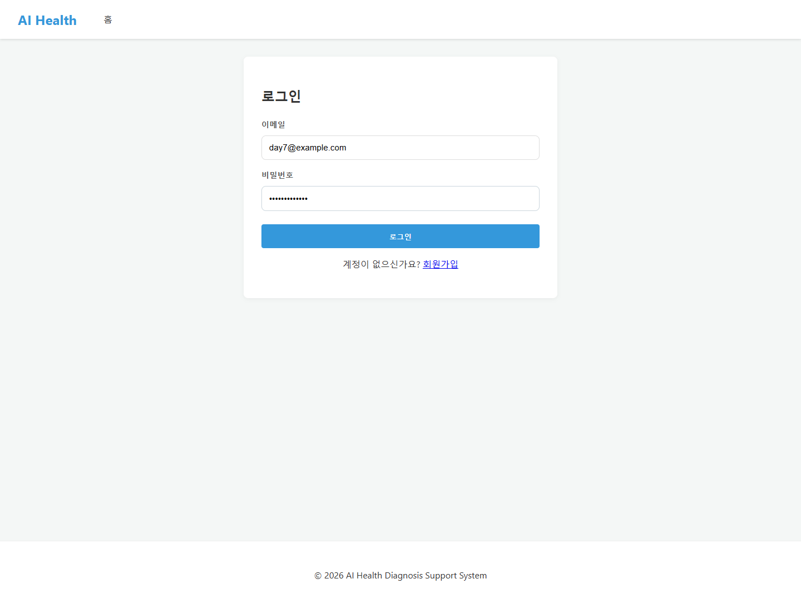
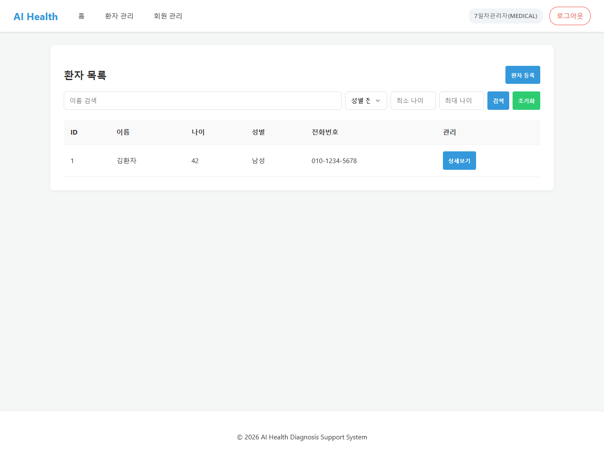
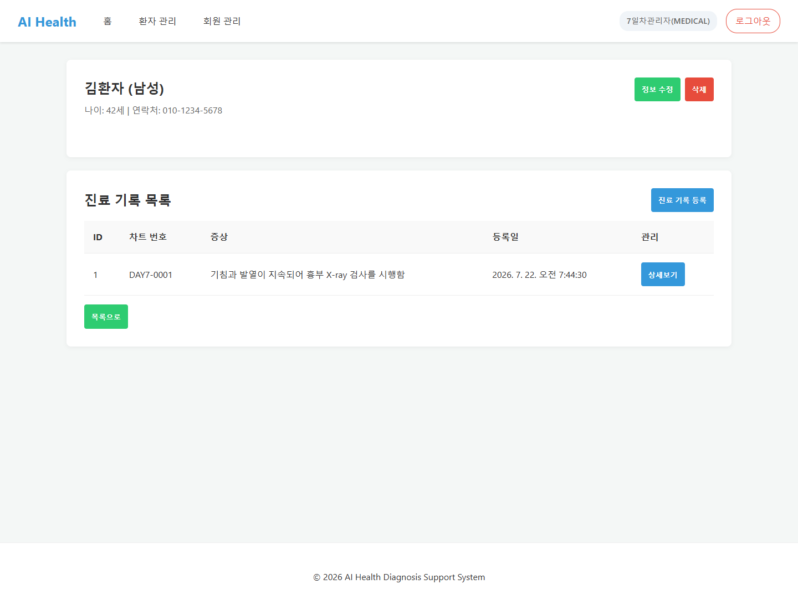
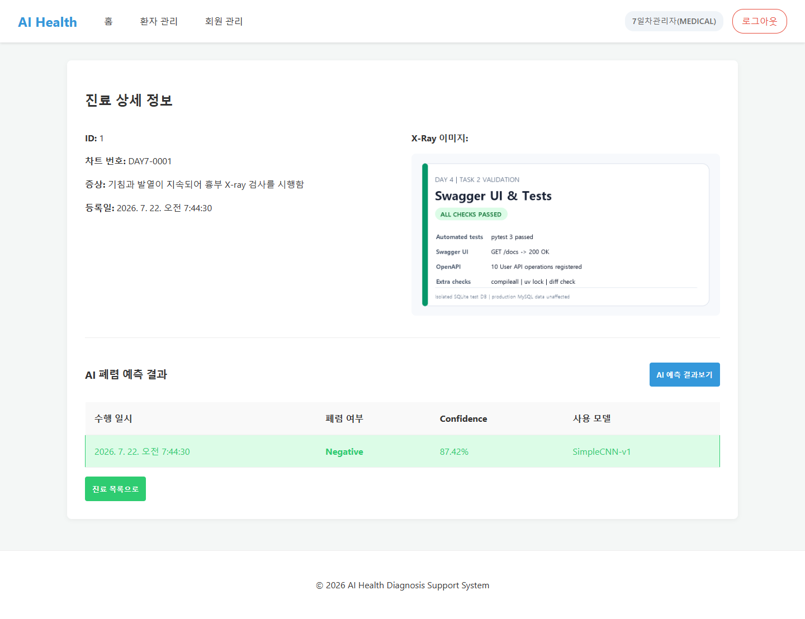
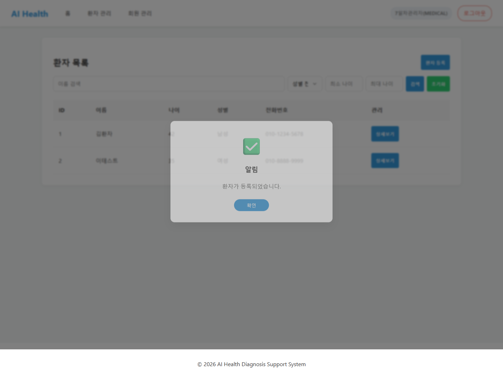

# 7일차 프론트엔드 API 연결 및 앱 실행 화면

## 1. 작업 개요

`static/`의 프론트엔드 템플릿을 FastAPI API 명세와 연결하고 실제 브라우저에서
로그인, 환자 관리, 진료기록 및 AI 예측 결과 화면을 확인했다.

연동 과정에서 확인된 주요 불일치는 다음과 같이 수정했다.

- 진료기록 등록 URL을 `/api/v1/patients/{patient_id}/medical-records`로 수정
- 환자 요청·응답 전화번호 필드를 `phone`으로 통일
- 환자 성별을 백엔드 Enum인 `M`, `F`로 통일
- 진료기록의 `xray_images` 배열에서 이미지 URL을 표시하도록 수정
- 누락된 환자 등록·목록·상세·수정 API를 5일차 설계서에 맞게 연결
- `.env`의 `DATABASE_URL`을 이용해 MySQL과 SQLite 실행 환경을 선택할 수 있도록 보완

## 2. 실행 방법

MySQL 환경에서는 기존 DB 설정을 사용한다. 로컬 SQLite로 빠르게 확인할 때는
`.env`에 다음 값을 설정할 수 있다.

```env
DATABASE_URL=sqlite+aiosqlite:///./day7_demo.db
```

앱 실행 명령어:

```bash
fastapi run app/main.py
```

접속 주소:

```text
http://127.0.0.1:8000/
```

## 3. Endpoint별 프론트엔드 연결

| 화면·기능 | Method | Endpoint | 확인 결과 |
| --- | --- | --- | --- |
| 로그인 | `POST` | `/api/v1/users/login` | `200 OK` |
| 내 정보 조회 | `GET` | `/api/v1/users/me` | `200 OK` |
| 환자 등록 | `POST` | `/api/v1/patients` | `201 Created` |
| 환자 목록 조회 | `GET` | `/api/v1/patients` | `200 OK` |
| 환자 상세 조회 | `GET` | `/api/v1/patients/{patient_id}` | `200 OK` |
| 환자별 진료기록 목록 | `GET` | `/api/v1/patients/{patient_id}/medical-records` | `200 OK` |
| 진료기록 상세 조회 | `GET` | `/api/v1/medical-records/{record_id}` | `200 OK` |
| AI 예측 결과 목록 | `GET` | `/api/v1/medical-records/{record_id}/analyses` | `200 OK` |

브라우저 자동 검증에서 실패한 API 요청과 JavaScript Console 오류는 없었다.

## 4. 실행 화면

### 4.1 로그인

이메일과 비밀번호를 입력해 로그인 API를 호출한다.



### 4.2 환자 목록 조회

로그인 후 환자 목록을 조회하고 이름·성별·나이·전화번호를 화면에 표시한다.



### 4.3 환자 상세 및 진료기록 목록

환자 상세정보와 해당 환자의 진료기록 목록을 함께 조회한다.



### 4.4 진료기록 및 AI 예측 결과

진료기록, 등록된 이미지와 저장된 폐렴 예측 결과를 화면에 표시한다.



### 4.5 환자 등록

환자 정보를 입력하여 등록한 뒤 목록에 추가된 결과를 확인했다.



## 5. 최종 확인

- [x] FastAPI 앱 로컬 실행
- [x] 프론트엔드 로그인 API 연결
- [x] 환자 등록·목록·상세 API 연결
- [x] 진료기록 및 AI 예측 결과 조회 연결
- [x] 모든 확인 요청이 `2xx` 상태로 응답
- [x] 브라우저 Console 오류 없음
- [x] Endpoint별 실행 화면 문서화
