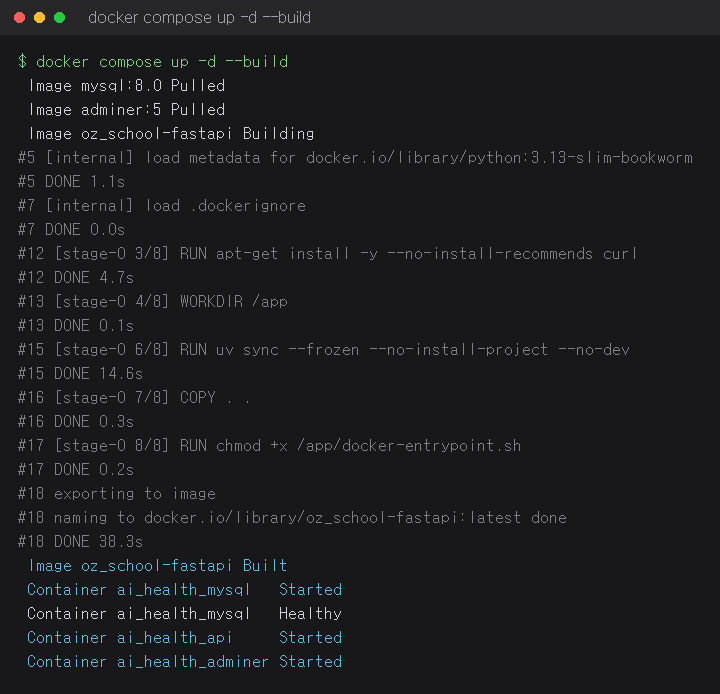
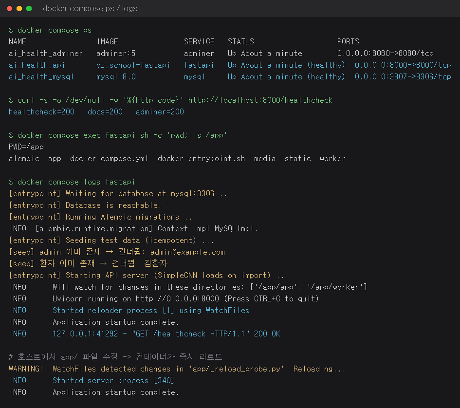
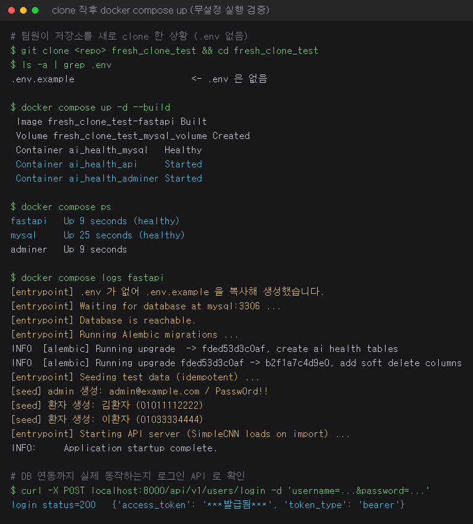

# 8일차 — Docker Compose 로 FastAPI + MySQL 컨테이너 실행

## 1. 과제 조건과 충족 방법

| 조건 | 충족 방법 | 위치 |
|---|---|---|
| 프로젝트 루트에 `docker-compose.yml` 생성 | 루트에 작성 | [`docker-compose.yml`](../docker-compose.yml) |
| 앞서 작성한 Dockerfile 로 이미지 빌드 | `build.context: .`, `build.dockerfile: Dockerfile` | `docker-compose.yml` |
| fastapi 서비스 정의 | `fastapi` 서비스 (uvicorn + SimpleCNN 추론 포함) | `docker-compose.yml` |
| mysql 서비스 정의 | `mysql:8.0` 서비스 + 헬스체크 + 데이터 볼륨 | `docker-compose.yml` |
| 로컬 볼륨을 컨테이너 `/app` 에 마운트 | `- .:/app` (이미지 WORKDIR 도 `/code` → `/app` 으로 통일) | `docker-compose.yml`, `Dockerfile` |
| `--reload` 로 코드 수정 즉시 반영 | `UVICORN_RELOAD=1` → 엔트리포인트가 `uvicorn --reload` 로 기동 | `docker-entrypoint.sh` |

## 2. 서비스 구성

| 서비스 | 이미지 | 포트(호스트→컨테이너) | 역할 |
|---|---|---|---|
| `fastapi` | 루트 `Dockerfile` 빌드 | 8000 → 8000 | FastAPI API 서버 + SimpleCNN 폐렴 예측 |
| `mysql` | `mysql:8.0` | 3307 → 3306 | 애플리케이션 DB (로컬 MySQL 3306 과 충돌 방지) |
| `adminer` | `adminer:5` | 8080 → 8080 | DB 확인용 웹 UI (선택) |

- 볼륨: `mysql_volume`(DB 데이터), `media_volume`(업로드된 X-ray 이미지)
- 기동 순서: `depends_on.condition: service_healthy` 로 MySQL 이 준비된 뒤 API 가 시작된다.

### 마운트 구성 (`/app`)

```yaml
volumes:
  - .:/app              # 로컬 소스 전체 → 컨테이너 /app (코드 수정 즉시 반영)
  - /app/.venv          # 이미지 안에서 uv 로 만든 가상환경 보존(호스트 .venv 로 덮이지 않게)
  - media_volume:/app/media
```

- 이미지의 `WORKDIR`, `PYTHONPATH`, 엔트리포인트 경로를 모두 `/app` 으로 맞췄다.
- 호스트 `.venv` 가 컨테이너 가상환경을 가리는 문제는 익명 볼륨(`/app/.venv`)으로 차단했다.

### 자동 리로드

```sh
uvicorn app.main:app --host 0.0.0.0 --port 8000 --reload \
    --reload-dir /app/app --reload-dir /app/worker
```

- 감시 대상을 소스 디렉터리로 한정해 `.venv` 의 수만 개 파일을 감시하지 않도록 했다.
- Windows/WSL 의 바인드 마운트는 inotify 이벤트가 컨테이너로 전달되지 않으므로
  `WATCHFILES_FORCE_POLLING=true` 를 설정해야 `--reload` 가 실제로 동작한다.

## 3. 실행 방법

```bash
# 이미지 빌드 + 컨테이너 실행
docker compose up -d --build

# 상태 확인
docker compose ps
docker compose logs -f fastapi

# 종료 (데이터까지 삭제하려면 -v)
docker compose down
```

접속: API `http://localhost:8000`, Swagger `http://localhost:8000/docs`, Adminer `http://localhost:8080`

`.env` 가 없어도 그대로 실행된다.
- compose 는 `env_file: required: false` + `${VAR:-기본값}` 으로 기본값을 사용한다.
- 컨테이너 기동 시 `.env` 가 없으면 `.env.example` 을 복사해 자동 생성한다(로컬 개발 한정).
- `.env.example` 의 DB 값과 compose 기본값은 동일하게 맞춰 두었다. 값이 어긋나면 이미 초기화된
  MySQL 볼륨의 계정과 불일치해 두 번째 실행부터 인증에 실패하기 때문이다.

## 4. 실행 화면

### 4.1 이미지 빌드 및 컨테이너 실행 (`docker compose up -d --build`)



### 4.2 컨테이너 상태 / 헬스체크 / 로그



### 4.3 신규 clone 후 무설정 실행 검증

저장소를 새로 clone 해 `.env` 가 없는 상태에서 `docker compose up -d --build` 만 실행한 결과다.
`.env` 자동 생성 → Alembic 마이그레이션 → 시드 데이터 생성 → 로그인 API 200 까지 확인했다.



> 위 이미지는 실제 실행한 `docker compose` 출력 로그를 터미널 형태로 렌더링한 것이다.

## 5. 검증 결과

| 항목 | 결과 |
|---|---|
| `docker compose up -d --build` | 성공 (이미지 `oz_school-fastapi` 빌드 후 3개 컨테이너 기동) |
| 컨테이너 상태 | `fastapi`, `mysql` 모두 `healthy` |
| API 응답 | `/healthcheck` 200, `/docs` 200, Adminer 200 |
| `/app` 마운트 | 컨테이너 내부 `pwd` = `/app`, 호스트 소스 트리 그대로 노출 |
| `--reload` | 호스트에서 `app/` 파일 수정 시 `WatchFiles detected changes ... Reloading` 후 재기동 확인 |
| 마이그레이션·시드 | 빈 DB에서 `alembic upgrade head` 2건 적용, admin·환자 2명 시드 생성 |
| 로그인 API | `POST /api/v1/users/login` 200, 액세스 토큰 발급 확인 |

## 6. 참고 — 기본값과 보안

- compose 의 기본 자격증명(`ai_health_user` 등)과 `JWT_SECRET_KEY` 기본값은 **로컬 개발 전용**이다.
- 실제 배포(Koyeb 등)에서는 `.env` 가 아니라 플랫폼 secret 으로 주입하며,
  `.env` 자동 생성 로직도 로컬 개발(`UVICORN_RELOAD=1`)에서만 동작하도록 막아 두었다.
- `.env` 는 `.gitignore` 대상이라 저장소에 커밋되지 않는다.
